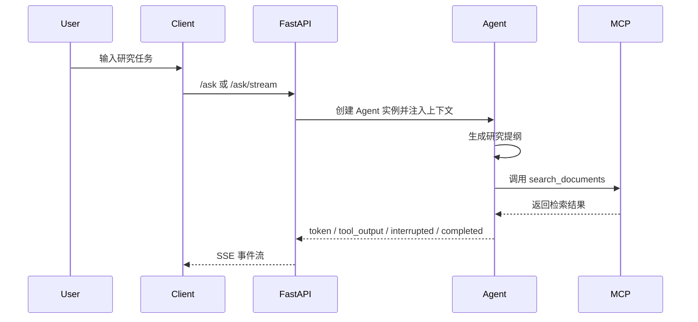

# ResearchFlowAgent

`ResearchFlowAgent` 是一个面向知识工作流的研究型 Agent 全栈项目，核心能力聚焦在研究提纲生成、RAG 检索、SSE 流式输出、Human-in-the-Loop 审批、Markdown 报告落盘，以及用户偏好记忆。


## 能力

- `POST /ask`：同步执行研究型 Agent
- `POST /ask/stream`：SSE 流式输出规划、检索和结果
- `POST /intervene`：人工审批后恢复执行
- `POST /intervene/stream`：审批后的流式续跑
- `GET /ui`：作品集风格的浏览器研究工作台，可直接演示完整前后端链路
- `search_documents`：通过 MCP 调用 Milvus 检索
- `build_research_outline`：生成结构化研究提纲
- `save_markdown_report`：保存 Markdown 研究报告
- `remember_user_preference`：记录长期偏好

## 目录结构

```text
ResearchFlowAgent
├── agent_api.py
├── api_test.py
├── requirements.txt
├── .env.example
├── ui/
├── prompt/
├── utils/
├── rag_mcp/
├── milvus/
├── docker_files/
└── tests/
```

## 技术栈

- Python 3.12
- FastAPI
- HTML / CSS / Vanilla JavaScript
- LangChain / LangGraph
- PostgreSQL
- Milvus
- MCP
- Pytest

## 快速开始

### 1. 安装依赖

```bash
cd ResearchFlowAgent
pip install -r requirements.txt
```

### 2. 配置环境变量

先复制模板：

```bash
cp .env.example .env
```

再把 `.env` 导入当前终端：

```bash
set -a
source .env
set +a
```

至少需要确认这些配置正确：

- `OPENAI_API_KEY` 或你实际使用的模型供应商配置
- `DB_URI`
- `MILVUS_URI`
- `API_BASE_URL`

### 3. 初始化 Milvus

```bash
cd milvus
python 01_create_database.py
python 02_create_collection.py
python 03_insert_data.py
```

### 4. 启动 MCP 检索服务

```bash
cd rag_mcp
python mcp_start.py
```

### 5. 启动 Agent API

```bash
cd ..
python agent_api.py
```

### 6. 运行接口测试

```bash
python api_test.py
python api_test.py --stream --debug
```

### 7. 打开 Web UI

启动后访问：

```text
http://127.0.0.1:8202/ui
```

页面支持：

- 输入研究任务并调用 `/ask/stream`
- 实时查看 token、工具输出和完成态
- 在浏览器中审批 `search_documents` 工具调用
- 查看最终结构化报告和来源列表

## 核心交互链路


